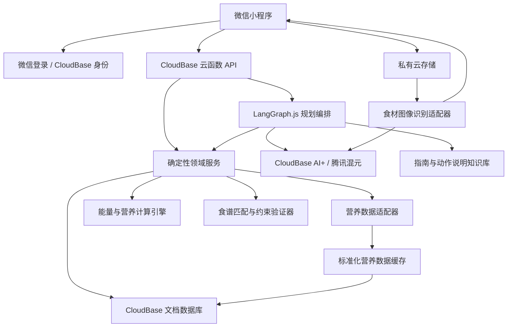

# Fitness 饮食与训练规划助手

> 项目状态：统一开发主线 `feat/v1.0` 已建立；阶段 1、2 已完成，阶段 3–7 待开发
> 目标平台：面向中国大陆健康成年人的微信小程序  
> 架构基线日期：2026-07-30

## 开发主线与进度

后续开发和推送固定在 `feat/v1.0`，不再新增开发分支或 Git 工作区。开始开发前必须读取 [`DEVELOPMENT_PROGRESS.md`](DEVELOPMENT_PROGRESS.md)，完成阶段工作后同步更新其中的验收项、验证证据、剩余工作和阻塞项；该文件是唯一动态进度清单。

历史阶段分支继续保留作审计与参考，但未进入 `feat/v1.0` 的实现不计入当前进度。原有设计和路线图仍是规划依据，具体状态不在 README 重复维护。

## 第二阶段本地与云端运行

环境要求：Node.js `20` 或 `22`、pnpm `9.15.x`，以及用于打开客户端的微信开发者工具。

在仓库根目录依次执行：

```powershell
pnpm.cmd install
pnpm.cmd lint
pnpm.cmd typecheck
pnpm.cmd test
pnpm.cmd build
pnpm.cmd dev:api
```

`pnpm.cmd dev:api` 会构建并启动 CloudBase 兼容的本地函数服务，监听 `http://127.0.0.1:3000/`。保持该终端运行，再执行 `pnpm.cmd open:miniprogram`；该命令会显式生成本地 API 构建并通过微信开发者工具打开仓库项目。若工具未注册开始菜单快捷方式，可将 `WECHAT_DEVTOOLS_CLI` 设置为 `cli.bat` 的绝对路径。

常规 `pnpm.cmd build` 同时生成云端小程序构建和可部署的 `.build/cloudfunctions/planning-api` 单文件制品。客户端通过 `wx.cloud.callFunction` 调用 `planning-api`，用户身份只取自云函数运行时的可信 OpenID。真实部署前需配置微信 AppID 和 CloudBase 开发环境，并应用拒绝客户端直读数据库的规则；仓库不提交环境 ID 或密钥。部署与双身份验收清单见 [`docs/cloudbase/phase-2-deployment.md`](docs/cloudbase/phase-2-deployment.md)。

无需打开小程序也可以执行 `pnpm.cmd smoke:api`：它会在隔离端口启动真实函数进程，验证健康检查、受支持能量预览和超出适用范围三种场景，然后回收子进程。`pnpm.cmd dry-run:api` 用于确认 CloudBase 函数构建产物可被本地运行框架加载。

自动化验收覆盖 lint、类型检查、单元测试、构建、CloudBase 本地加载和真实 HTTP 进程烟雾测试。`pnpm.cmd open:miniprogram` 只负责构建并请求已安装的微信开发者工具打开项目；页面在 IDE 内的实际渲染，以及受支持/不受支持两次表单交互，仍需人工确认，不能由命令退出码替代。

当前实现用一个原子命令保存身体档案、目标、一周训练计划、受影响日期的能量目标、幂等结果和 `TrainingPlanChanged` outbox 事件；请求在响应丢失后会复用同一幂等键安全重试。独立编辑会使旧的下游活动指针失效，当前上下文只返回一致的活动版本链，同时返回各实体的历史版本计数。

同周训练变更只为发生新增、移动、取消或时长变化的未来日期追加能量目标版本；过去事实不改写。每日目标同时记录 `calculation-policy-v2` 和 `nutrition-policy-v1`，其中 `nutrition-policy-v1` 目前仅为来源追溯元数据，阶段二尚不计算宏量营养素、食材克数、食谱或餐单。CloudBase 聚合文档从 schema v2 开始，没有已部署的阶段二 v1 数据需要迁移。

## 项目简介

Fitness 是一款目标驱动的健身与饮食规划应用。它不是一次性回答“今天吃什么”的聊天机器人，而是维护一条持续联动的规划链路：

```text
身体数据与偏好 → 健身目标 → 一周训练计划 → 每日能量/营养目标 → 食谱与克数 → 实际完成记录 → 后续计划修正
```

用户录入身体数据、健身目标和一周训练计划，并通过表单或照片登记现有食材。系统根据每天的训练负荷推荐食谱及食材用量；当训练计划或实际完成情况改变时，系统重新计算受影响日期的能量目标和食谱，而不是继续沿用已经失效的饮食建议。

本产品只服务自述健康的成年人，提供一般性的健身与膳食规划，不提供疾病诊断、治疗、康复、孕期营养或未成年人营养建议。受当前中国人群基础代谢研究适用范围限制，MVP 只有在用户年龄为 18–45 岁且 BMI 为 `18.5–<24.0` 时，才自动生成个性化维持、减脂或增肌能量目标；范围外用户只能使用不带能量盈亏的均衡食谱与食材管理功能。

## MVP 核心场景

1. 用户录入年龄、性别、身高、体重、日常活动水平、过敏原、忌口和饮食偏好。
2. 用户选择减脂、增肌或维持目标，并设置目标周期。
3. 用户通过结构化表单创建一周训练计划，包括训练日、动作、组次、时长和主观强度。
4. 系统估算每日能量消耗，并生成与训练负荷相匹配的每日营养目标。
5. 用户手动录入或拍照识别现有食材；照片识别结果必须经用户确认。
6. 系统从已验证的食谱模板和营养数据中推荐食谱、食材克数及营养汇总。
7. 用户可通过有限对话换菜、调整份量或移动训练日。
8. 用户确认实际训练完成度后，系统修正当天或后续日期的饮食计划。

## MVP 范围

包含：

- 微信登录与用户数据隔离。
- 身体档案、目标、一周训练计划和版本历史。
- 训练计划结构化录入，不支持训练截图或视频识别。
- 食材手动录入与照片辅助识别。
- 每日热量和蛋白质、脂肪、碳水目标。
- 自动个性化能量目标仅覆盖 18–45 岁、BMI `18.5–<24.0` 且通过健康范围确认的用户。
- 基于现有食材、过敏原、忌口和营养目标的食谱推荐。
- 一周饮食计划、换菜、调份量和有限对话修改。
- 计划变更联动、实际完成度反馈、失败降级与来源说明。

首版不包含：

- 医疗营养、疾病管理、孕妇、未成年人或康复训练。
- 可穿戴设备、心率或连续运动数据接入。
- 训练动作视频识别、姿态纠正或自动计数。
- 完全开放式的健康问答和自主多 Agent 决策。
- 仅凭照片自动估算精确食材重量。
- 社区、商城、私教、付费订阅和广告系统。

## 核心产品规则

以下规则属于不可破坏的业务约束：

1. **目标先于计划，计划先于推荐。** 没有有效目标和训练计划时，不生成个性化一周食谱。
2. **训练与饮食必须通过日期和计划版本关联。** 每个每日营养目标都能追溯到身体档案版本、目标版本、训练计划版本和计算策略版本。
3. **变更只影响应当改变的数据。** 过去日期不改写；未来未锁定日期自动重算；用户已经确认或手动修改的餐单先展示变化差异，再由用户决定是否覆盖。
4. **数值由代码计算。** 大模型不得直接决定热量、宏量营养素或克数，也不得把自然语言输出当作结构化事实写入数据库。
5. **识图结果必须确认。** 视觉模型只返回候选食材、置信度和可能的规格，用户确认后才能进入库存和营养计算。
6. **过敏原是硬约束。** 任何推荐都不得为了满足热量目标而放宽过敏原限制。
7. **显示估算性质。** 热量消耗和摄入均以估算值或区间展示，不宣称医疗级精度。
8. **先检查适用范围。** 年龄、BMI、健康确认或必要输入不满足策略要求时，不生成个性化能量盈亏数值。
9. **证据不足时关闭输出。** 缺少可核验来源、来源超出适用人群或营养约束无解时，返回明确原因，不由模型或代码默认值补齐。

## 技术选型

| 层级 | 选择 | 原因 |
|---|---|---|
| 客户端 | 微信原生小程序 + TypeScript | 只面向微信，减少跨端框架和适配层 |
| UI | 微信原生组件，按需引入小程序组件库 | 保持包体、可访问性和交互可控 |
| 后端 | 腾讯云开发 CloudBase Node.js 云函数 | 无需管理服务器，原生连接微信身份、数据库和存储 |
| Agent 编排 | LangGraph.js 单 Agent 状态图 | 流程可测试、可恢复、可版本化，适合 Codex 辅助开发 |
| 大模型 | CloudBase AI+ 接入腾讯混元 | 国内可用，支持工具调用和小程序/Node.js 集成 |
| 图像理解 | 混元视觉模型，供应商适配器封装 | 识别多种候选食材；服务可替换 |
| 业务数据库 | CloudBase 文档型数据库 | JSON 结构灵活，支持事务、索引和快速迭代 |
| 文件存储 | CloudBase 私有云存储 | 保存待识别图片并实施生命周期清理 |
| 知识库 | CloudBase AI+ 知识库 | 用于低频更新的指南、动作说明和解释性内容 |
| 营养接口 | TianAPI 营养成分表，经过本地标准化与缓存 | MVP 优先覆盖国内常见食物，不让运行时完全依赖第三方 |
| 动作数据 | 自建并版本化经典动作库 | 保证中文质量、授权、稳定性和 MET 映射一致性 |
| 热量计算 | 自建 TypeScript 计算引擎 | 计算可追溯、可测试，不依赖 LLM 或黑盒计算 API |

CloudBase 支持数据库、云存储、身份认证、云函数和 AI 能力，并提供 LangGraph 的 Agent 部署路径，满足“不自建服务器”的要求。

## 总体架构



小程序不直接持有第三方密钥，也不直接执行营养计算或写入 Agent 生成的任意 JSON。所有外部调用、参数校验、权限检查和最终写入都发生在云函数侧。

## Agent 的职责边界

MVP 使用一个编排 Agent，而不是多个互相对话的 Agent。LangGraph 状态图负责：

- 判断用户是在修改目标、训练计划、食材还是食谱。
- 补齐执行领域命令所需的参数。
- 调用受控工具读取或变更计划。
- 在计划变化后启动确定性重算流程。
- 把结构化结果解释成自然语言，并提示估算范围和数据来源。

Agent 可以调用的工具应保持小而明确，例如：

- `get_current_context`
- `update_goal`
- `create_training_plan_version`
- `record_training_completion`
- `recognize_ingredients`
- `confirm_inventory_items`
- `recalculate_impacted_days`
- `replace_meal`
- `resize_meal_portion`

Agent 不得直接操作集合、拼接数据库查询、运行任意代码或绕过领域服务。

## 记忆与知识库

### 长期记忆：结构化数据库

长期状态包括身体档案、目标、偏好、过敏原、计划版本、实际完成记录、食材库存和用户确认过的替换。它们是业务事实，必须存入数据库并带版本、来源和时间戳。

建议的首批集合：

- `users`
- `body_profile_versions`
- `goals`
- `training_plan_versions`
- `training_completion_events`
- `daily_nutrition_targets`
- `inventory_items`
- `exercise_catalog`
- `nutrition_foods`
- `recipe_templates`
- `meal_plan_versions`
- `conversation_summaries`
- `recalculation_jobs`

### 短期记忆：有限会话上下文

对话只保留完成当前修改所需的最近消息和结构化摘要。默认最多向模型发送最近 12 条消息；长期偏好从数据库读取，不依赖无限增长的聊天记录。

### 知识库：解释性内容

知识库只用于回答“为什么这样安排”、动作说明和一般膳食原则。营养数值、用户状态、计划版本和过敏原不得仅存在向量知识库中。知识文档必须记录标题、发布者、发布日期、许可/使用条件、导入日期和原始链接。

## 外部 API 与数据策略

### 食材照片

1. 小程序把照片上传到用户私有路径。
2. 云函数取得临时访问权限并调用视觉模型。
3. 模型返回候选食材列表，不估算精确克数。
4. 用户确认名称、状态（生/熟/可食部分）和可用重量或份数。
5. 后端把名称映射到标准食材 ID，再查询营养数据。
6. 原图默认在识别完成后 24 小时内删除，只保留用户确认后的结构化结果。

可选降级：视觉模型不可用时允许手动录入；后续可接入百度果蔬/通用物体识别作为第二供应商。

### 营养数据

TianAPI 只通过 `NutritionProvider` 适配器访问。每条标准化记录至少保存：

- 标准食材 ID、供应商名称和供应商原始 ID。
- 中文名称、别名、食物类别和生熟状态。
- 每 100 克可食部分的能量、蛋白质、脂肪和碳水。
- 微量营养素、单位、可食部比例（可获得时）。
- 数据来源、抓取时间、供应商版本和质量状态。

对外展示和计算优先使用已审核缓存。正式商业上线前必须确认接口的数据来源、商业授权、缓存许可、SLA 和退出机制；无法证明来源的记录不得标记为“权威数据”。

### 训练动作

首版自建 80–120 个经典动作，每个动作包含中文名称、别名、动作模式、目标肌群、辅助肌群、器械、难度、步骤、常见错误、禁忌提示、默认强度区间和 MET 映射。图片和视频必须为原创、已购买授权或许可清晰的素材。

### 供应商隔离

外部服务必须通过接口适配器调用，领域层不得引用供应商字段：

```text
VisionProvider
NutritionProvider
LanguageModelProvider
KnowledgeRetriever
```

所有调用设置超时、一次有限重试、熔断和可观测日志；测试环境使用固定桩数据，不依赖实时供应商。

## 计算原则

MVP 的确定性计算策略版本为 `calculation-policy-v2`。策略输出是规划起点而非人体测量值；间接测热才是基础代谢测量的参考方法，任何公式都存在个体误差。

每次计算结果必须引用策略版本和证据来源 ID。策略对象至少保存 `policyVersion`、`sourceIds`、`applicableAgeRange`、`applicableBmiRange`、`effectiveDate` 和 `reviewedAt`；不得把公式、阈值或来源只写在提示词中。

### 适用范围门禁

自动个性化能量目标仅在以下条件全部满足时启用：

- 年龄为 18–45 岁。
- BMI 为 `18.5–<24.0`。
- 用户以最小化排除项确认自己不属于疾病治疗、孕期/哺乳期、进食障碍、伤病康复或其他需要专业营养管理的人群；不收集详细诊断和病历。
- 身高、体重、年龄、公式所需性别变量、日常非训练活动等级和训练计划完整且通过范围校验。

不满足时返回 `unsupported_for_personalized_energy`，不得悄悄切换公式。用户仍可使用食材管理和依据《中国居民膳食指南（2022）》的一般均衡食谱，但不得得到自动减脂或增肌热量。

### 基础消耗与日常活动

在上述范围内，使用针对中国正常体重成年人的公式估算基础代谢：

```text
估算 BMR(kcal/日) = 14.52 × 体重(kg) - 155.88 × S + 565.79
S：男性 = 0，女性 = 1
```

该公式来自 18–45 岁、正常体重中国成年人的研究，独立验证样本较小且报告准确率为 75.6%，因此界面只显示“初始估算”及适用范围，不使用“精准基础代谢”。公式中的性别变量必须由用户提供，不得由姓名、头像或模型推断。

日常活动等级只评价工作、通勤和家务，不包含已经录入训练计划的运动，采用中国居民参考 PAL：轻 `1.50`、中 `1.75`、重 `2.00`。

```text
非训练基线消耗 = 估算 BMR × 非训练 PAL
估算维持消耗 = 非训练基线消耗 + 当日计划训练净消耗
```

### 训练消耗

根据 2024 Adult Compendium 的会话级活动类别、用户主观强度和有效时长映射 MET：

```text
净训练千卡 = (MET - 1) × 3.5 × 体重(kg) ÷ 200 × 分钟
```

力量训练的组次只用于辅助推断有效时长和强度档位，不假装能从“重量 × 次数”得到精确消耗。动作库不得为单个力量动作自行编造 MET；只能引用经过人工审核的 Compendium 会话类别和来源代码。存在多个合理类别时输出估算区间。用户实际完成度按 0–100% 修正有效时长，但不会改写已经发生的事实记录。

### 目标与宏量营养素

- 维持：以估算日消耗为中心值。
- 减脂：初始能量调整为估算维持消耗的 `-10%`；目标体重不得使 BMI 低于 `18.5`。
- 增肌：初始能量调整为估算维持消耗的 `+5%`；研究支持把 `5%–20%` 作为需按训练经验个体化的保守盈余范围，但 MVP 不自动扩大盈余。
- MVP 不提供任何自动扩大能量盈亏的逻辑。除训练计划变化导致的确定性重算外，体重趋势只产生复核提示，不自动继续增减热量。
- 若用户提供了可用的体重记录，观察到每周下降超过 `0.5 kg`、增肌期每周增长超过当前体重的 `0.5%`，或目标即将越过 BMI 门禁时，停止继续下调或上调并要求重新评估。
- 无计划训练时，蛋白质采用中国成年人 RNI：男性 `65 g/日`、女性 `55 g/日`；一般运动或耐力训练使用 `1.4 g/kg/日`；规律抗阻训练或增肌使用 `1.6 g/kg/日`。MVP 不自动推荐超过 `2.0 g/kg/日`。
- 脂肪以目标能量的 `25%` 为中点，并强制处于 `20%–30%E`；饱和脂肪 `<10%E`。
- 碳水化合物不得只是“剩余热量”，必须同时满足 `50%–65%E` 和至少 `120 g/日`。
- 膳食纤维目标为 `25–30 g/日`，添加糖 `<10%E`；食谱还要满足食物多样性和过敏原硬约束。
- 如果蛋白质、脂肪、碳水、纤维、食材可用量和总能量无法同时满足，返回 `nutrition_constraints_infeasible` 并解释冲突，不放宽健康与过敏原约束。

蛋白质的训练规则来自健康运动人群研究，不得扩展到肾病等不在产品范围内的人群。宏量营养素、膳食纤维、添加糖和饱和脂肪的公开可核验基线采用 WS/T 578.1—2017；生产上线前必须与《中国居民膳食营养素参考摄入量（2023 版）》正式表格再次核对，并通过新策略版本记录任何差异。后续策略升级只影响新生成的计划，历史计划保留原策略版本。

### 科学证据登记

| 来源 ID | 用途 | 适用范围与限制 |
|---|---|---|
| `CN-DRI-2023` | 当前中国 DRIs 总体依据及上线前复核 | 中国居民群体或个体；精确常量只从正式表格录入，不从二手网页抄录 |
| `CN-DRI-MACRO-2017` | PAL、RNI、宏量营养素、纤维、添加糖和饱和脂肪公开基线 | 健康中国居民；升级时必须检查 2023 版差异 |
| `CN-BMR-2023` | 中国正常体重成年人 BMR 初始公式 | 18–45 岁、BMI `18.5–<24.0`；独立验证样本小，不能外推 |
| `CN-RMR-2019` | 公式误差与中国成年人适用性复核 | 预测公式有明显个体误差，支持只显示估算值 |
| `MET-COMPENDIUM-2024` | 会话级训练 MET 映射 | 无显著影响代谢疾病或残障的成年人；不是个体测量值 |
| `PROTEIN-MORTON-2018` | 抗阻训练蛋白质 `1.6 g/kg/日` | 健康抗阻训练成年人，不能作为全人群常量 |
| `ISSN-PROTEIN-2017` | 一般运动人群 `1.4–2.0 g/kg/日`范围 | 健康运动人群；MVP 取保守默认并设自动上限 |
| `NHC-WEIGHT-2024` | 减重速度和停止复核 | 国家卫健委体重管理原则；本产品不开展肥胖临床治疗 |
| `ENERGY-SURPLUS-2023` | 增肌盈余和增重速度 | 抗阻训练人群；`+5%` 是保守产品起点，不是生理定律 |
| `IOC-REDS-2023` | 低能量可用风险提示 | 运动人群；产品只做风险停止提示，不作 REDs 诊断 |

### 食谱匹配

食谱推荐以模板筛选和约束求解为主：先执行过敏原、忌口、食材可用性等硬过滤，再按热量和宏量营养素误差排序。LLM 可以解释选择或生成口语化步骤，但不能凭空增加食材、营养值或克数。

## 训练变更与饮食联动

训练计划每次保存都创建不可变版本，并产生带生效日期的领域事件：

```text
TrainingPlanChanged
  → 找出变更日期及受影响的未来日期
  → 计算新旧计划每周训练净消耗差值
  → 按训练日期重新估算每日训练消耗
  → 创建新的每日营养目标版本
  → 重新匹配未锁定餐单
  → 对已锁定餐单生成差异提示
  → 用户确认后激活新的一周计划版本
```

过去日期永不回写。当天尚未训练或用餐时可以提示重算；已经完成的记录保持事实不变。重算任务必须幂等，同一变更事件重复投递不得生成多个有效版本。

训练计划联动必须满足：

```text
每周训练消耗变化 = Σ新计划净训练消耗 - Σ旧计划净训练消耗
```

增加、取消、移动训练或修改有效时长/强度都必须改变相应未来日期的营养目标；只移动训练日时保持整周训练净消耗不变，只重新分配日期。系统不得用模型解释文本代替该差值计算。

## 异常与降级

- 识图失败：保留照片上传状态，切换为手动食材录入。
- 营养 API 失败：优先读取审核缓存；没有可靠数据时要求用户换用可识别食材，不让 LLM补数值。
- 模型失败：结构化表单、计算和既有计划仍可用；有限对话暂时不可用。
- 重算失败：旧计划继续保持有效，新版本标记为失败并允许重试。
- 数据冲突：通过版本号和幂等键拒绝覆盖较新的用户修改。
- 无可行食谱：明确指出缺失的食材或营养缺口，不放宽过敏原约束。

## 隐私、安全与合规

- 只收集完成推荐所必需的数据，不收集详细病史和诊断信息；健康范围只使用最小化排除项确认。
- 身体数据、目标和照片默认私有；按用户 ID 执行最小权限访问。
- 涉及身体与健康相关信息时提供清晰告知、同意、导出、更正和删除入口。
- API Key 和供应商密钥只保存在 CloudBase 服务端密钥配置中。
- 日志不得记录原始照片、完整身体档案、访问令牌或用户自由文本全文。
- 公开上线前核查小程序隐私保护指引、个人信息保护要求、生成式 AI 应用登记、模型备案号公示和 AI 内容标识要求。
- 所有页面明确说明结果仅供一般健身和膳食规划参考；出现疾病、伤痛、进食障碍或极端目标时停止个性化建议。

## 测试与验收基线

至少覆盖以下自动化测试：

- 能量公式、单位换算、舍入和策略版本单元测试。
- 18/45 岁和 BMI `18.5/24.0` 边界、缺失输入及不支持人群测试。
- BMR 来源与性别编码、PAL 排除显式训练及 MET 来源完整性测试。
- 减脂/增肌默认值、停止条件和禁止自动扩大盈亏测试。
- 蛋白质分支、脂肪/碳水/纤维上下限及无可行解测试。
- 训练计划变更影响范围与幂等重算测试。
- 食谱营养汇总等于各食材营养之和。
- 过敏原、忌口和食材可用量的属性测试。
- LLM/视觉/营养供应商适配器契约测试。
- 视觉候选未确认时不得进入库存的流程测试。
- 旧计划在新计划生成失败时仍保持有效。
- 不同用户之间的数据权限隔离测试。

MVP 验收必须证明：移动某个训练日后，受影响日期的训练消耗、营养目标和未锁定食谱同步变化且整周总训练消耗不凭空改变；过去记录和无关日期不被改写；页面展示的营养总数能够由已存食材数据复算得到；不支持的人群、缺少来源的数据和无可行营养解都不会生成伪造数值。

## 建议目录结构

```text
fitness/
├─ miniprogram/                 # 微信小程序
├─ cloudfunctions/              # CloudBase 云函数入口
├─ packages/
│  ├─ domain/                   # 领域实体、策略与领域事件
│  ├─ calculation/              # 能量和营养计算
│  ├─ agent/                    # LangGraph 状态图与受控工具
│  ├─ providers/                # 模型、视觉、营养、知识库适配器
│  ├─ contracts/                # 跨端 DTO 与运行时校验
│  └─ test-fixtures/            # 固定测试数据
├─ data/
│  ├─ exercises/                # 版本化动作数据
│  └─ recipes/                  # 已验证食谱模板
├─ docs/
│  ├─ decisions/                # ADR 架构决策记录
│  └─ superpowers/specs/        # 已确认设计稿
├─ AGENTS.md
└─ README.md
```

目录只是实施基线；在编写实施计划前，不创建空壳模块或引入依赖。

## 参考资料

- [腾讯云开发 CloudBase 产品概述](https://cloud.tencent.com/document/product/876/18431)
- [CloudBase AI+ 与 Agent 开发](https://cloud.tencent.com/document/product/876/130727)
- [CloudBase 数据库与知识库对比](https://docs.cloudbase.net/ai/agent/data-model)
- [CloudBase 知识库](https://docs.cloudbase.net/ai/agent/knowledgebase)
- [腾讯混元 Function Calling](https://cloud.tencent.com/document/product/1729/111007)
- [TianAPI 营养成分表](https://www.tianapi.com/apiview/121-2)
- [TianAPI 食物营养识别](https://www.tianapi.com/apiview/248)
- [百度菜品识别](https://ai.baidu.com/tech/imagerecognition/dish/)
- [中国居民膳食营养素参考摄入量（2023）](https://www.cnsoc.org/drpostand/)
- [WS/T 578.1—2017 中国居民膳食营养素参考摄入量：宏量营养素](https://www.nhc.gov.cn/ewebeditor/uploadfile/2017/10/20171017152901174.pdf)
- [中国居民膳食指南（2022）](https://dg.cnsoc.org/)
- [中国正常体重成年人基础代谢预测公式研究（2023）](https://pmc.ncbi.nlm.nih.gov/articles/PMC10574416/)
- [中国大陆成年人静息代谢公式验证研究（2019）](https://pubmed.ncbi.nlm.nih.gov/31374849/)
- [2024 Adult Compendium of Physical Activities](https://pmc.ncbi.nlm.nih.gov/articles/PMC10818145/)
- [抗阻训练蛋白质补充系统综述与荟萃分析（2018）](https://bjsm.bmj.com/content/52/6/376)
- [ISSN 蛋白质与运动立场文件（2017）](https://pmc.ncbi.nlm.nih.gov/articles/PMC5477153/)
- [国家卫生健康委体重管理指导原则（2024）](https://www.nhc.gov.cn/cms-search/downFiles/f932c5c0004f4959b92613dd1024483c.pdf)
- [国家卫生健康委居民体重管理核心知识释义（2024）](https://www.nhc.gov.cn/cms-search/downFiles/5e20de34c0fe45bb9fcac0636b21ad98.pdf)
- [抗阻训练者不同能量盈余研究（2023）](https://pmc.ncbi.nlm.nih.gov/articles/PMC10620361/)
- [IOC 运动中相对能量不足共识（2023）](https://bjsm.bmj.com/content/57/17/1073)
- [生成式人工智能服务管理暂行办法](https://www.cac.gov.cn/2023-07/13/c_1690898327029107.htm)
